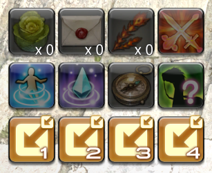
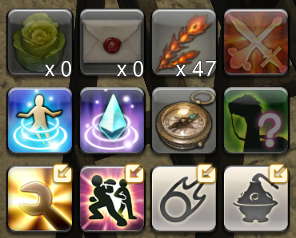

# Character Data Sync (Extended)

A fork of [Xpahtalo/Dalamud.CharacterSync](https://github.com/Xpahtalo/Dalamud.CharacterSync) that adds **Command Panel sync** - copies your main character's Quick Panel (Command Panel) layout, settings, and shortcut icons to all alt characters on login.

## Features

All sync is driven by your designated main character. Your other (alt) characters automatically receive the main's data on login.

Everything from the original plugin (hotbars, macros, keybinds, chatlog filters, character settings, card sets, HUD layout, automatic backups), plus:

- **Command Panel** - panel contents across all 4 pages, custom page icons, panel settings (tint, behaviour), and shortcut icons

## Install

> **Custom repository URL:** `https://raw.githubusercontent.com/redactedkai/Dalamud.CharacterSync-Extended/master/repo.json`

1. In-game, open **Dalamud Settings** → **Experimental** → **Custom Plugin Repositories**
2. Add the URL above and save
3. Open **Plugin Installer** → search **Character Data Sync** → Install
4. Open `/pcharsync`, log in as your main character, and click **"Set save data to current character"**
5. Log out and back in on any alt character - sync applies automatically on login

## Known Quirks

### Command Panel shortcut icons (first login only)

On the first login to an alt character, the hotbar shortcut icons may show as default numbered placeholders instead of your main character's icons.

| Before | After |
|---|---|
|  |  |

**Fix:** Open the Command Panel settings (gear icon at top-right), then click any of the shortcut buttons on your hotbar. This is a one-time fix per alt - all future logins show the correct icons automatically.

## Build Instructions

For build instructions, dev plugin loading, and technical implementation details, see [DEVELOPMENT-NOTES.md](DEVELOPMENT-NOTES.md).
